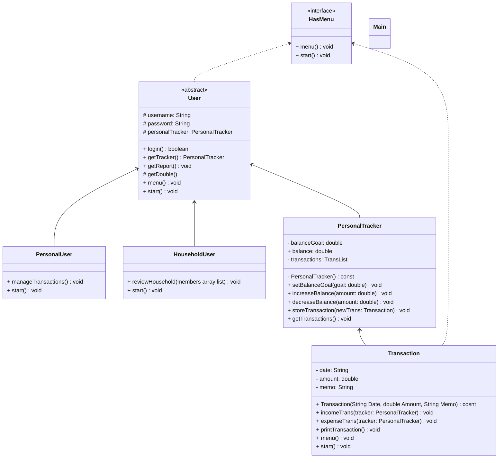

# HasMenu() interface
```
string menu()
void start()
```

# Transaction() implements HasMenu
```
date: string
ammount: double
memo: string

Transaction (date, ammount, memo)
    date = date
    ammount = ammount
    meme = memo
incomeTrans(Personal Tracker tracker)
    increase balance in respect to ammount
expenseTrans(Personal Tracker tracker)
    decrease balance in respect to ammount
menu()
    print menu
start()
getTransaction()
    print transaction
```

# PersonalTracker()
```
balanceGoal: double
balance: double
transactions: TransList

setBalanceGoal(num)
    sets bal goal
increaseBalance(num)
    increases bal
decreaseBalance(num)
    dec bal
storeTransaction(Transaction newTrans)
    adds tran to tran list
getTransactions()
    returns transactions for user
```

I got rid of the household tracker because I can handle everything in the personal tracker class

# User()
```
String username
String password
PersonalTracker personalTracker

user()
    setup for new user
bool login()
    checks for sucessful login
getTracker()
    returns tracker class for user
getReport()
    returns all transactions for user
getDouble()
    returns double
menu()
    handles menu
start()
```

# PersoalUser extends User
```
PersonalUser()
    null constructor

Start()
    handles menu and logic
```
