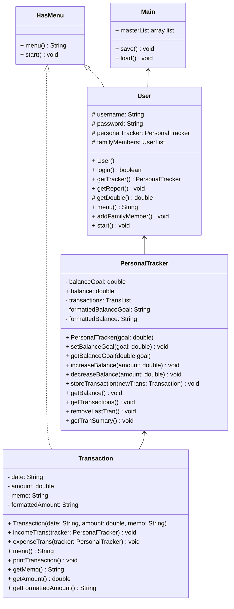

# HasMenu() interface
```
string menu()
void start()
```

# Transaction() implements Serializable
```
date: String
ammount: double
memo: String
formattedAmount: String

Transaction (date, ammount, memo)
    date = date
    ammount = ammount
    meme = memo
    formattedAmount = String foramt amount (to look like money xxx.xx)
incomeTrans(Personal Tracker tracker)
    increase balance in respect to ammount
expenseTrans(Personal Tracker tracker)
    decrease balance in respect to ammount
menu()
    print menu
start()
printTransaction()
    return date, formattedAmount, memo
```

# PersonalTracker()
```
balanceGoal: double
balance: double
transactions: TransList
formattedBalanceGoal: String
formattedBalance: String

Perosnaltracker(goal)
    if goal is positive
        set balanceGoal to goal
    else
        tell user the goal must be a positive number
        set goal to 0

setBalanceGoal(goal)
     if goal is positive
        set balanceGoal to goal
    else
        tell user the goal must be a positive number
        set goal to 0

getBalanceGoal()
    return balanaeGoal

increaseBalance(amount)
    balance += amount

decreaseBalance(amount)
    balance -+ amount

storeTransaction(newTrans)
    add newTrans to transactions

getBalance()
    bal = 0
    for each transaction
        bal += ammount of the transaction

    return bal

getTransactions()
    tranNum = 1

    if there are no transactions
        print "no transactions"

    for all transactions
        print tranNUm
        printTransaction()
        tranNum += 1

removeLastTran()
    if no transactions
        print "there are no transactions"

    else
        remove last transaction from transactions
        print removed transaction

getTranSummary()
    print budget
    print blance

    if balance is negative
        print "you are in the negatives"
    else if balance > budget
        print how much you are over the goal
    else if balance = budget
        print "you are at your budget goal"
    else if balance < budget
        print how much you are under your goal
```

# User()
```
String username
String password
PersonalTracker personalTracker
UserList familyMembers

user()
    take input for username = username
    take input for password = password
    take input for budget = budget
    print sucess message
    create PersonalTracker
    create familyMembers
    add self to familyMembers

bool login()
    takes input for password

    if password is correct
        return true

    else
        return false

getTracker()
    returns tracker class for user

getReport()
    returns all transactions for user

getDouble()
    takes user input

    try to parse input
    catch bad values and return 0
        result = 0

    return result

getUsername
    return username

menu()

addFamilyMember(user)
    if user is already in the familt
        print "already in family"
    else
        add user to familyMembers

start()
    print menu options
    keepGoing = true

    while keepGoing:    
        if choice is perosnal
            print personal menu
            keepGoing = true

            while keepGoing:
               if choice is income
                    take input of details
                    add income to transactios

                else if choice is expense
                    take input of details
                    add expense to transactions

                else if choice is remove last tran
                    removeLastTran()

                else if choice is set budget
                    take input of new budget
                    input = balanceGoal

                else if choice get summary
                    getReprot()
                    getTranSummary()

                else if choice is logout
                    keepGoing = false

                else
                    print "must choose good value"
        
        else if choice is family
            print family menu
            keepGoing = true

            while keepGoing:
                if choice is view total
                    grandTotal = 0
                    grandTotal += users balance

                    for all family members
                        grandTotal += balance

                    return grandTotal

                else if choice is view transactions
                    for all family members
                        print name of member
                        print transactions

                    for all family members
                        goal = 0
                        goal += all of the members goal
                        print goal

                    for all family members
                        balance = 0
                        balance += all of the members balance
                        pring balance

                else if choice is add member
                    member = input
                    if user is in another family
                        print error message

                    else
                        add member to familyMembers
                        keepGoing = false

                else if choice is remove member
                    take input of member
                    if member is in familyMembers
                        remove them

                else if choice is log out
                    keepGoing = false

                else
                    print "must choose good value"

        else if choice is delete
            take passowd input

            if password = input
                remove user form familyMembers
                remove user form masterList

        else if choice is logout
            print "loging out"

        else
            print "must choose good value"
```

# Main()
```
main()
    load()
    print menu
    keepGoing = True

    While keepGoing:
        if choice is login
            if there are no users
            print "no users"
            make new user
            add user to masterList

            ask for username
            i = 0
            found = false
            while i is less than the size of masterList AND not found
                if username is correct
                    if login()
                        start()
                i++

            if not found
                print "user not found"
    
        if choice is create account
                create a new user
                add user to masterList

        if choice is exit
            keepGoing = false

    save()

save()
    try
        create a fileOutputStream for Buddy.dat
        create a new ObjectOutputStream
        write masterList
        close everything
    catch
        return the error

load()
    try
        create a fileInputStream for Buddy.dat
        create a new ObjectInputStream
        read masterList
        close everything
    catch
        return the error
```

I do not have an admin login for this program because it is intended to be used by the user, and there is no need for someone to have access to all of the user data. 
I have not used any algorithms other than the ones listed in this documentation, and all of what I have done are algorithms that we have learned in class.
There are no special extensions needed to run this program. It is designed to run in the terminal with nothing but what is included in this repo.
You can run this program with the standard make run.

Thank you for such a great semester. This is by far the class that has taught me the most new skills, and I have been able to make some pretty cool programs with them. I hope you have a restful summer! -Avrum
                
